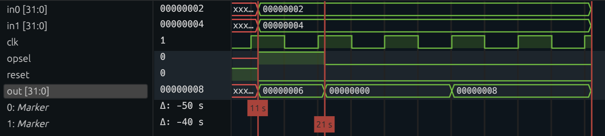

+++
title = "Draft: An Introduction to Filament"
date = 2024-09-16
+++

These days, everybody wants to design custom hardware and they want to do it quickly. Historically, the go-to tool for that
has been an HDL like SystemVerilog or VHDL. Many people (me included) are dissatisfied with this; traditional HDLs provide
a very tedious and error-prone programming model. In response,
a lot of very smart people have thought up interesting alternatives to traditional HDLs with the goal of making hardware design
more accessible and productive (links to come). Here, I'll talk about the one I work on: [Filament](https://filamenthdl.com).

Before we get there, though, we'll work through a small example in Verilog that will highlight the specific problem that
we want to solve with Filament.

## An example
Let's start small -- we'll design a simple ALU that can support multiplication and addition. I'll be writing my code snippets in 
Verilog, and I'll explain each step so even if you've never seen an HDL before, you can still follow what we're doing.

Here's what our signature will look like. If anyone else wants to use our ALU in their design, this is what they'll see.

```
module alu
(
    input  logic [31:0] in0,
    input  logic [31:0] in1,
    input  logic        opsel,
    output logic [31:0] out
);
```

Our signature is straightforward: we have 32-bit operands and have a 1-bit control signal to select between multiplication and
addition. Let's move on to the first part of the component's body.

```
    logic [31:0] add_result;
    assign add_result = in0 + in1;
```

We can use Verilog's `+` operator and it'll synthesize just fine. Let's move on to multiplication.

```
    logic [31:0] mult_result;
    assign mult_result = in0 * in1;
```

This would also work fine, but let's say that we aren't happy with how our downstream tools will synthesize the `*` operator.
Luckily, we have access to someone else's multiplier implementation; let's instantiate that instead.

```
    logic [31:0] mult_result;
    
    imul multiplier
    (
        .clk   ()
        .reset ()
        .in0   ()
        .in1   ()
        .out   ()
    );
```

Here, `imul` is the module name and `multiplier` is the named instantiation of it inside our circuit. It looks like we'll need
`clk` and `reset` signals for it; let's add those to our module signature.

```
module alu
(
    input logic         clk,
    input logic         reset,

    input  logic [31:0] in0,
    input  logic [31:0] in1,
    input  logic        opsel,
    output logic [31:0] out
);
```

Now, we can make the port connections for our instantiation.

```
    logic [31:0] mult_result;
    
    imul multiplier
    (
        .clk   (clk)
        .reset (reset)
        .in0   (in0)
        .in1   (in1)
        .out   (mult_result)
    );
```

One more step: we need to drive the output of our ALU. We'll do that with a mux to choose between the add and 
multiply outputs.

```
    assign out = opsel ? add_result : mult_result;
```
This will assign `out` to `add_result` when `opsel` is 0 and `mult_result` when it is 1. 

Looks like we're done! Time to test our ALU. I won't go through the short test bench I wrote for our ALU, but if you're
curious you can view the code [here](https://github.com/gabizon103/intro-filament).

I made a file `alu_tb.v` which can be used to simulate our design with `iverilog`:

```
% iverilog -Wall -g2012 -o alu_tb alu_tb.v
```

I included print statements in the test bench, so we can inspect the output:
```
% ./alu_tb

cycle 0: in0 = 00000002, in1 = 00000004, opsel = 1
cycle 0: out = 00000006
cycle 1: in0 = 00000002, in1 = 00000004, opsel = 0
cycle 1: out = 00000000
```

We start out by testing our ALU's add functionality, and 2 + 4 does indeed equal 6! We test multiplication on the next
cycle, but something is off. Instead of getting 8 like we expect, we get 0. This is weird, so let's dig into the
waveform that we generated from our test bench.

<!-- {{ img(id="content/blog/filament1/img.png") }} -->


At cycle 0, we see that `opsel` is 1, meaning we are computing the addition. In that same cycle, `out` is 6. This makes sense, because addition is combinational. In the next cycle,
we set `opsel` to 0. However, `out` doesn't become 8 until cycle 3.

Aha! This is an important clue. Implicit in our ALU design was our assumption that the multiplier would return its output
in the same cycle we sent its inputs. The waveform tells us this can't be true, but let's look at the code for the multiplier
to confirm:

```
    logic [31:0] mult_s1;
    logic [31:0] mult_s2;
    logic [31:0] mult_s3;
    logic [31:0] mult_s4;

    always_ff @(posedge clk) begin
        if (reset) begin
            mult_s1 <= 32'd0;
            mult_s2 <= 32'd0;
            mult_s3 <= 32'd0;
        end else begin
            mult_s1 <= in0 * in1;
            mult_s2 <= mult_s1;
            mult_s3 <= mult_s2;
            mult_s4 <= mult_s3;
        end
    end

    assign out = mult_s4;
```

Let's step through this block of code. This multiplier has 4 pipeline stages. In the first stage, we compute the multiplication
using `*`. `mult_s1`, `mult_s2`, and `mult_s3` each represent the pipeline registers we use to store the result of each stage.
the `always_ff` block specifies what assignments we should make at the start of each clock cycle. If reset is asserted, we should
set all of our registers to 0. Otherwise, we can forward the computation along from the previous register.

The fundamental problem with our original ALU was the fact that we expected the results from the adder and the multiplier to be ready
at the same time. Let's go back and fix that:

```
    logic [31:0] add_s1;
    logic [31:0] add_s2;
    logic [31:0] add_s3;
    logic [31:0] add_result;

    always_ff @(posedge clk) begin
        if (reset) begin
            add_s1 <= 0;
            add_s2 <= 0;
            add_s3 <= 0;
            add_result <= 0;
        end else begin
            add_s1 <= in0 + in1;
            add_s2 <= add_s1;
            add_s3 <= add_s2;
            add_result <= add_s3;
        end
    end
```

This block of code computes the addition and then saves the result until the multiplication is finished. Let's try testing
again. 
```
./alu_tb
cycle 0: in0 = 00000002, in1 = 00000004, opsel = 1
cycle 0: out = xxxxxxxx
cycle 1: in0 = 00000002, in1 = 00000004, opsel = 1
cycle 1: out = xxxxxxxx
cycle 2: in0 = 00000002, in1 = 00000004, opsel = 1
cycle 2: out = xxxxxxxx
cycle 3: in0 = 00000002, in1 = 00000004, opsel = 1
cycle 3: out = 00000006
cycle 4: reset = 1
cycle 5: in0 = 00000002, in1 = 00000004, opsel = 0
cycle 5: out = 00000000
cycle 6: in0 = xxxxxxxx, in1 = xxxxxxxx, opsel = 0
cycle 6: out = 00000000
cycle 7: in0 = xxxxxxxx, in1 = xxxxxxxx, opsel = 0
cycle 7: out = 00000000
cycle 8: in0 = xxxxxxxx, in1 = xxxxxxxx, opsel = 0
cycle 8: out = 00000008
alu_tb.v:70: $finish called at 101 (1s)
```

On cycle 0, we send the ALU our addition. It doesn't finish until cycle 3, where we see the correct output. On cycle 5,
we send the ALU our multiplication. It doesn't finish until cycle 8, where we see the correct output. If you look closely
at the above trace, you'll see that when we send the multiplication, we don't have to assert `in0` and `in1` for all 4 cycles;
looking at our implementation, you'll notice that's because we only read from `in0` and `in1` in cycle 0. You'll notice something
similar for `opsel`; we only read from it in the very last cycle of our computation.

Now, that was a lot of information about our circuit. Information which is critical to our circuit functioning properly,
especially if it is interacting with other circuits. And, as you definitely noticed, none of it was explicit in our Verilog
code. We had to carefully extract all of it and try real hard not to forget any of it. What if there was a better way?

## The better way
Now, we can finally understand where Filament comes in. This is what our ALU's signature would look like in Filament:
```
comp ALU<'G:1>(
    go: interface['G],
    in0: ['G, 'G+1] 32,
    in1: ['G, 'G+1] 32,
    opsel: ['G+3, 'G+4] 1
) -> (
    out: ['G+3, 'G+4] 32
)
```

This is necessarily more verbose than a Verilog signature. Let's break it down. `comp ALU` means this is a component named ALU;
simple enough. `<'G:1>` means that there is an event `'G` associated with this component that has a delay of 1; more on that later.
`go: interface['G]` means we can think of the event `'G` as signaling the "start" of the computation. Filament's events correspond
directly to clock cycles, so `'G` is really a clock cycle. Everything else inside of `ALU` happens in relation to `'G`. 

`in0: ['G, 'G+1] 32` means `in0` is a port of width 32, and it has the *availability interval* of `['G, 'G+1]`. This idea corresponds
directly to the observation we just made about our ALU only reading from `in0` and `in1` in the first cycle of its computation. We've
encoded this directly into the language, and soon we'll see the cool things we can do with that. Similar observations can be made about
`in1`, `opsel`, and `out`.

Now, let's implement our ALU and see what happens if we make the same mistake as before. We have access to Filament's primitive
library, which includes components like adders, multipliers, and muxes. Here is the signature for an adder:

```
comp Add[IN_WIDTH, ?OUT_WIDTH=IN_WIDTH]<'G: 'L-('G), ?'L: 1='G+1>(
      left: ['G, 'L] IN_WIDTH,
      right: ['G, 'L] IN_WIDTH,
   ) -> (
      out: ['G, 'L] OUT_WIDTH
   ) where 'L > 'G, IN_WIDTH <= OUT_WIDTH, IN_WIDTH > 0, OUT_WIDTH > 0;
```

We can tell this component is combinational because its outputs are produced in the same cycle that its
inputs are provided.

Here's the multiplier:
```
comp FastMult[W]<'G: 1>(
   left: ['G, 'G+1] W,
   right: ['G, 'G+1] W,
) -> (
   out: ['G+3, 'G+4] W,
) where W > 0
```

Again, now we know the precise timing behavior of our multiplier. What happens if we make a mistake similar to the one we made in our
Verilog implementation? We'll try it inside our Filament ALU.
```
    add := new Add[32]<'G>(in0, in1);
    mult := new FastMult[32]<'G>(in0, in1);
    mux := new Mux[32]<'G+3>(opsel, add.out, mult.out);
    out = mux.out;
```

In the first three lines, we are creating an **instance** of a component and then **invoking** it at the specified time with
the given inputs. In the case of the adder, we instantiate the `Add` component at time `'G` with inputs `in0` and `in1`. We bind
this invocation to the name `add`, so we can refer to its output ports later, like when we pass it into the mux. When we try to 
compile this code, we get the following error:

```
error: source port does not provide value for as long as destination requires
   ┌─ ../../proj/filament-blog1/alu.fil:14:37
   │
14 │     mux := new Mux[32]<'G+3>(opsel, add.out, mult.out);
   │                                     ^^^^^^^
   │                                     │
   │                                     source is available for ['G, 'G+1]
   │                                     required for ['G+3, 'G+4]

Compilation failed with 1 errors.
```
This error points out the exact problem we had to figure out ourselves earlier. The output of `add` is available at `'G`, but
the mux is expecting its inputs at `'G+3` because we invoked it at `'G+3` to account for the multiplier's delay. Now that we know
the problem, the fix is simple: extend the availability of `add.out` using a register.
```
    add := new Add[32]<'G>(in0, in1);
    add_reg := new Register[32]<'G, 'G+4>(add.out);

    mult := new FastMult[32]<'G>(in0, in1);
    mux := new Mux[32]<'G+3>(opsel, add_reg.out, mult.out);
    out = mux.out;
```

Now, we get a different error from the compiler.
```
error: event provided to invocation triggers more often that invocation's event's delay allows
   ┌─ ../../proj/filament-blog1/alu.fil:14:33
   │
 5 │ comp ALU<'G:1>(
   │             - this event triggers every 1 cycles
   ·
14 │     add_reg := new Register[32]<'G, 'G+4>(add.out);
   │                                 ^^ event provided to invoke triggers too often
   │
   ┌─ ./primitives/state.fil:6:29
   │
 6 │    comp Register[WIDTH]<'G: 'L-('G+1), 'L: 1>(
   │                             --------- invocation's event is allowed to trigger every 3 cycles

Compilation failed with 1 errors.
```
This error has to do with the **delay** of our ALU, which is associated with the ALU's event `'G`. In our signature, we specified
that `'G` has a delay of 1, which means that ALU can process a new input every cycle. If we look more closely at the error, we
see that it is telling us that because we use the register over the interval `'G, G+4`, we can't possibly handle new inputs. It is most
clear with an example: if we get a set of inputs at cycle 0, that computation will be using the register over cycles 0 to 4. If we then
get a set of inputs at cycle 1, that computation will need to use the register over cycles 1 to 5. This overlap causes a problem, since
we only have a single physical register. There are actually two fixes: we can either alter our signature to reflect this constraint by
changing the delay of `'G` to 3, or we can alter our design to achieve a delay of 1. Let's explore the second option:
```
    add := new Add[32]<'G>(in0, in1);
    r0 := new Register[32]<'G, 'G+2>(add.out);
    r1 := new Register[32]<'G+1, 'G+3>(r0.out);
    r2 := new Register[32]<'G+2, 'G+4>(r1.out);

    mult := new FastMult[32]<'G>(in0, in1);
    mux := new Mux[32]<'G+3>(opsel, r2.out, mult.out);
    out = mux.out;
```
We add a chain of registers, which achieves our desired throughput. Now, there won't be resource contention between two successive
inputs. Now, our program type checks. Let's test it.

We specify our inputs to the Filament design with a JSON:
```
{
    "opsel": [1, 0, 1, 0],
    "in0":   [3, 4, 5, 6],
    "in1":   [8, 9, 2, 3]
}
```
This means we drive `opsel` with a value of 1 on cycle 0, a value of 0 on cycle 1, and so on. Our output looks like this:
```
{"out": {"0": [11], "1": [36], "2": [7], "3": [18]}, "cycles": 7}
```
Success!

With Filament, we were able to express the fundamental constraints on our circuit through language-level constructs. This allowed
the compiler to automate much of the reasoning that we had to do ourself when we were using Verilog. One important limitation
of Filament is that it can only express statically-scheduled circuits, which are circuits whose timing behavior is input-independent.
In our example, our multiplier always took 4 cycles. However, you can imagine a multiplier that, for example, uses a left shift to 
compute its output if it detects that one of its operands is a power of two, for example. This is a dynamic circuit, which cannot
currently be expressed in Filament.

Still, this post has only scratched the surface of what is possible in Filament. We'll get into the rest of it in future posts.