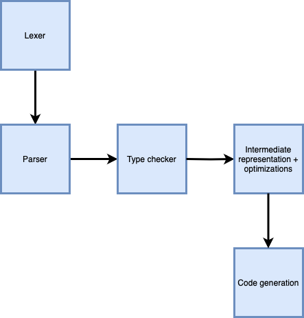

+++
title = "Compiler"
description = "I built a compiler for a C-like language from scratch."
+++

For Cornell's compilers class, I worked with two teammates to design and implement
a compiler for a procedural C-like language, called Eta. Here's a diagram of what our compiler
looked like: 

Eta programs look like this:

use io

sort(a: int[], len:int): int[] {
  i:int = 0
  n:int = len
  while (i < n) {
    j:int = i
    while (j > 0) {
      if (a[j-1] > a[j]) {
        swap:int = a[j]
        a[j] = a[j-1]
        a[j-1] = swap
      }
      j = j-1
    }
    i = i+1
  }

  return a
}

main(args: int[][]) {
  data:int[] = {...}
  data = sort(data, 26)
  print(data)
}


The first stage of our compiler, the lexer, breaks the program up into lexical tokens. For example,
a program that looks like this:

use io

main(args: int[][]) {
  x:int = 4;
  y:bool = true;
}


would produce this data:

1:1 use
1:5 id io
3:1 id main
3:5 (
3:6 id args
3:10 :
3:12 int
3:15 [
3:16 ]
3:17 [
3:18 ]
3:19 )
3:21 {
4:3 id x
4:4 :
4:5 int
4:9 =
4:11 integer 4
4:12 ;
5:3 id y
5:4 :
5:5 bool
5:10 =
5:12 true
5:16 ;
6:1 }


which specifies the location of each token in the source file.

The next stage, the parser, takes the output of the lexer and forms an abstract syntax tree (AST).
The AST for the above program looks like this:


(
 (
  (use io)
 )
 (
  (main((x int))(int)
   (
    (= (x int) 4)
    (= (y bool) true)
   )
  )
 )
)


At this point, we know the syntactic form of the program. So, we can raise errors because of things like syntax errors.

The next stage is the type checker, which traverses over the AST. When there are type errors, it raises an error.
For example, an assignment like {{ inlinecode(id="C", body="y:int = true") }} would raise a type error because
{{ inlinecode(id="C", body="y") }} is declared to have type {{ inlinecode(id="C", body="int") }} but a value
of type {{ inlinecode(id="C", body="bool") }} gets assigned to it.

Once we have verified the program free of syntax and type errors after parsing and type checking, we generate
our intermediate representation, which is a lowered representation of the program that is closer to the level
of assembly code. This is also where we perform our optimizations, like register allocation and common subexpression
elimination.

Finally, we generate assembly code from the intermediate representation. The intermediate representation and assembly
outputs get pretty lengthy for nontrivial programs, so I've omitted them here. But by the end of this pipeline,
we've generated assembly that conforms to the System V ABI and can be linked and executed!