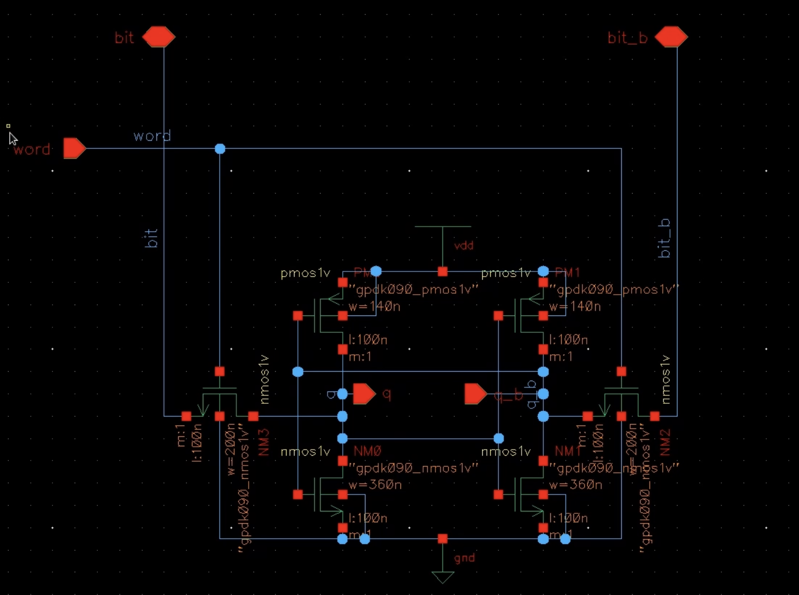
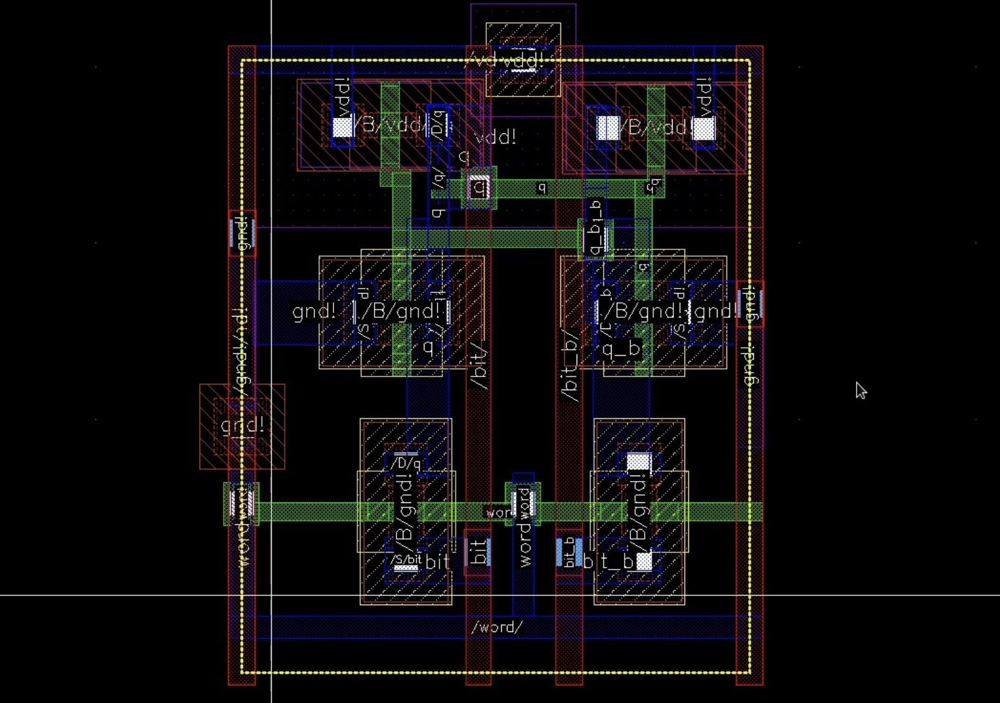
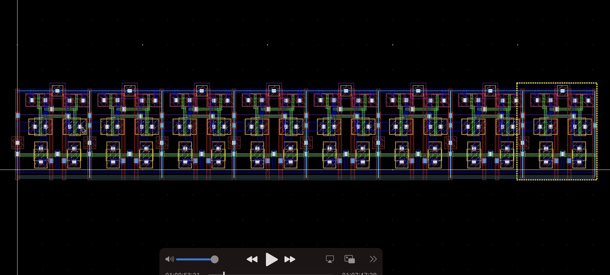
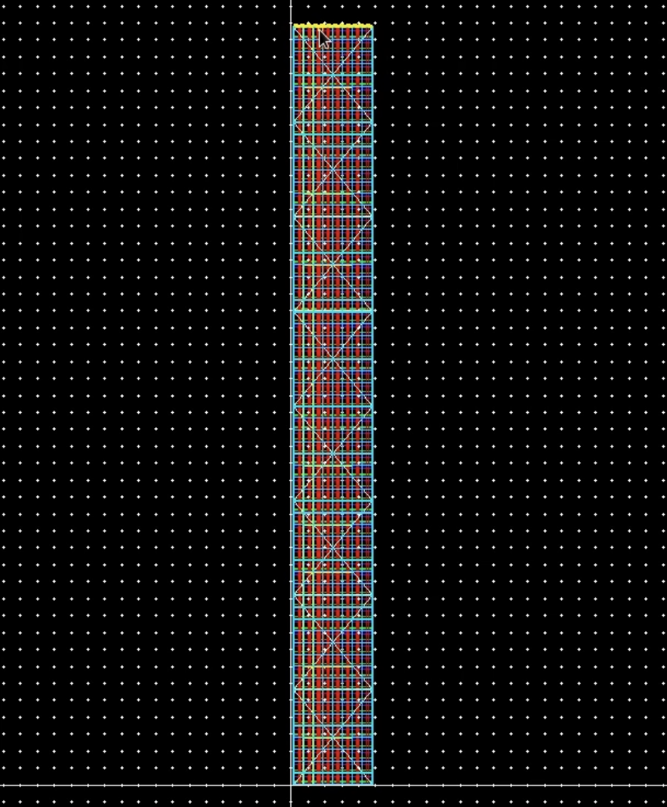
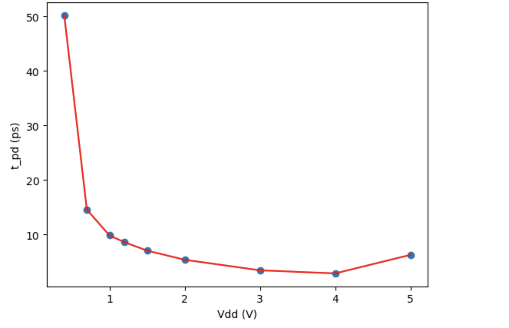
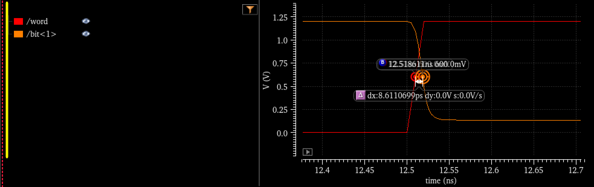

+++
title = "Static Random Access Memory Implementation"
description = "I designed the schematics and layout for an SRAM array."
+++

For Cornell's VLSI class, two teammates and I designed an SRAM array from scratch using Cadence.

Here's what a single SRAM cell schematic looks like:

We used a standard 6 transistor design, in a 90nm node. 
This is the layout view:

Each word in our memory was 8 bits, so this is the layout view for a word:

Here's the full SRAM, which is 64 words.

In addition to implementing the SRAM, we also designed and verified the peripheral components. This included
the row and column decoders, as well as the bitline conditioners and sense amplifiers.

I also worked on evaluating the performance of our SRAM cells. One experiment that I conducted involved
profiling the propagation delay of a cell as a function of its driving voltage. The propagation delay
is the amount of time it takes for a write to change the internal state of the cell. 

As expected, increasing the voltage decreases the propagation delay, meaning our circuit operates faster.
However, it also means that our circuit uses more energy. Here's how we measured each data point:

The word signal is the enable to the cell, and we measure the amount of time it takes for the bitline to change.
This page gives a brief overview of the project, check out the video below if you're interested in learning more!

{{ youtube(id="mj7Nm3uYApM", class="youtube") }}
